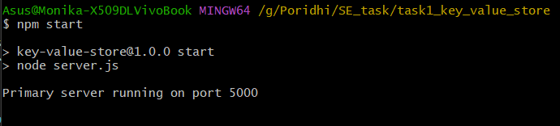
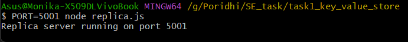
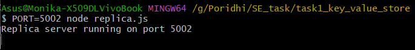
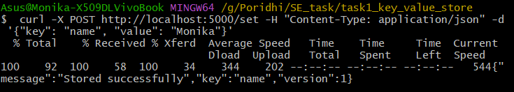
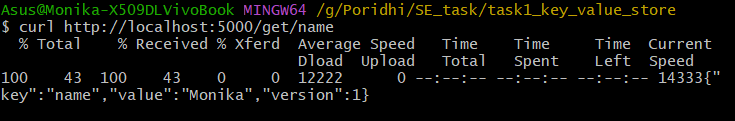
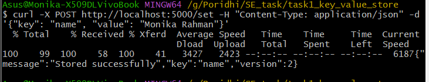
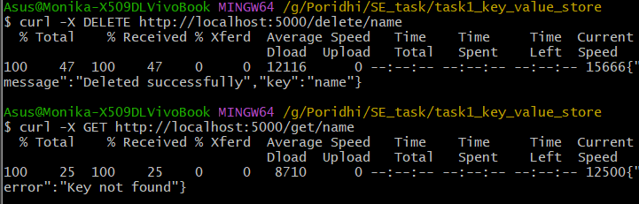
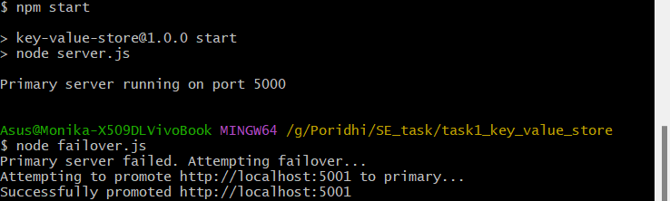

# Here's how you can think about Key-Value Store processes:


Think about a picture an office filing cabinet. Each drawer is clearly labeled - "Employee Records", "Invoices", "Contracts" etc. When you need something, you simply look at these labels and go straight to the right drawer. No need to search through everything - the label guides you directly to what you need.

A Key-Value Store works exactly like this filing cabinet, but in digital form. It's a database model that organizes data using unique labels (keys) to store and retrieve associated information (values). Think of it as your digital filing system where:

* The drawer labels become your "keys" (unique identifiers)
* The contents inside become your "values" (the actual data)

### Real-World Implementation
Modern businesses use powerful Key-Value Store systems like:

- Redis
- DynamoDB
- etcd

These systems handle digital data - with quick, direct access based on unique identifiers.

### Why It Works So Well
Key-Value Stores make digital data management:

- Fast (immediate access via keys)
- Reliable (straightforward structure)
- Flexible (can store any type of digital data)
- Scalable (easily expandable)

This simple but powerful approach makes Key-Value Stores a fundamental tool in modern data management.

# Key Features


- **Client**: Sends requests to the primary server.  
- **Primary Server**: Manages data, handles write operations, updates replicas via WebSockets.  
- **Replica Servers**: Handle read requests, store backups, sync data with the primary server.  
- **Failover Mechanism**: Monitors the primary server, promotes a replica if the primary fails, ensures data consistency.  

Here, some key features for implementing fast, reliable and safe key value store processes: 
## 1. In-Memory Store
- Stores data in RAM
- Provides fast access
- Quick operations

## 2. Data Replication
- Creates backup copies
- Prevents data loss
- Keeps system running

## 3. Versioning
- Tracks all changes
- Saves update history
- Allows viewing old versions

## 4. Failover Protection
- Monitors system health
- Switches to backup when needed
- Keeps service running

**Now, Running a Node.js Key-Value Store Using Git Bash (Windows) and Express.js is used to streamline the creation of the server and APIs**  
Follow these steps to run your **Node.js** project using **Git Bash** on Windows.  


Step 1: Install Git Bash (if not installed): 
 Open **Git Bash** after installation.  

Step 2: Install Node.js (if not installed): Download and install the **LTS Version**   
***Check installation by running the following in **Git Bash** or **Command Prompt*****:  
```bash
node -v
npm -v
```
**It displays the Node.js & npm versions**

Step 3: Navigate to Your Node.js Project Folder:

```bash
cd G:/Poridhi/SE_task/task1_key_value_store
```
**Adjust the command according to your folder path**


Step 4: Update **package.json** and set scripts: 

```bash
 "scripts": {
    "start-server": "node server.js",
    "start-replica1": "PORT=5001 node replica.js",
    "start-replica2": "PORT=5002 node replica.js",
    "start-failover": "node failover.js"}
```
**Ensure that server.js, replica.js and failover.js files exist in your project with necessary code for key value store in memory**


Step 5: Now, its time to run the Project ( using Git Bash)

***install dependecies:***
```bash
 npm install
```
***start the primary server ( server.js):***
```bash
 npm start
```
## Output: 

***Start the replica servers (replica.js):***
```bash
PORT=5001 node replica.js &
PORT=5002 node replica.js &
```
## Output: 


## Note: port are deifined at server.js file

# NOW,
Step 6: After starting all servers ( primary/replica), Test the API (Using Git Bash):

## **POST**: curl key value pair: 
```bash
curl -X POST http://localhost:5000/set -H "Content-Type: application/json" -d '{"key": "name", "value": "Monika"}'

```
This command sends a POST request to a local server with JSON data:

- **`curl`**: Making HTTP requests.
- **`-X POST`**: Sends a POST request.
- **`http://localhost:5000/set`**: The server URL (local server on port 5000).
- **`-H "Content-Type: application/json"`**: Specifies the data format as JSON.
- **`-d '{"key": "name", "value": "Monika"}'`**: Sends the data with `key` as `"name"` and `value` as `"Monika"`.


## Output: 


## **GET**: Read key value pair: 
```bash
curl -X GET http://localhost:5000/get/name


```
## Output: 


 ## **PUT**: Update existing key by updating the value and version number: 
```bash
curl -X POST http://localhost:5000/set -H "Content-Type: application/json" -d '{"key": "name", "value": "Monika Rahman"}'

```
## Output: 


## **DELETE:** Delete existing key: 
```bash
curl -X DELETE http://localhost:5000/delete/name
```
## Output: 



Step 7:  Now, how to Perform a Failover Check (Primary Server Failure Test)
You will test what happens when the Primary Server (5000) fails.
1. Stop the Primary Server (5000) by pressing CTRL + C
2. Start the failover system:

```bash
   node failover.js
```
## Output: 


Due to the failure of the primary server, the replica will take over as the primary server and perform tasks similar to the original primary server. This failover system will be checked continuously to ensure smooth operation. This way, we can complete the key-value store project.
